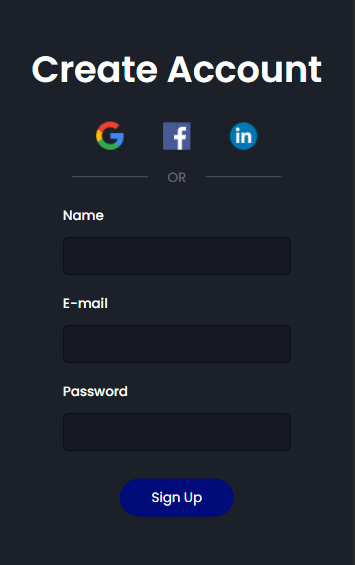

# Página de cadastro

Essa simples página de cadastro foi desenvolvida usando apenas HTML e CSS. 
Eu usei como base 2 vídeos da Girl Coding, onde em um ela ensina a fazer uma página de cadastro e em outro ela ensina a tornar a página responsiva.  
**Link do canal dela: https://www.youtube.com/c/GirlCoding/videos**
### Web Version

### Mobile Version

